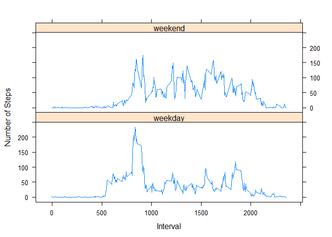

## Introduction

It is now possible to collect a large amount of data about personal movement using activity monitoring devices such as a Fitbit, Nike Fuelband, or Jawbone Up. These type of devices are part of the “quantified self” movement – a group of enthusiasts who take measurements about themselves regularly to improve their health, to find patterns in their behavior, or because they are tech geeks. But these data remain under-utilized both because the raw data are hard to obtain and there is a lack of statistical methods and software for processing and interpreting the data.

This assignment makes use of data from a personal activity monitoring device. This device collects data at 5 minute intervals through out the day. The data consists of two months of data from an anonymous individual collected during the months of October and November, 2012 and include the number of steps taken in 5 minute intervals each day.

The data for this assignment can be downloaded from the course web site:

Dataset: [Activity monitoring data](https://d396qusza40orc.cloudfront.net/repdata%2Fdata%2Factivity.zip)  

The variables included in this dataset are:

steps: Number of steps taking in a 5-minute interval (missing values are coded as \color{red}{\verb|NA|}NA)
date: The date on which the measurement was taken in YYYY-MM-DD format
interval: Identifier for the 5-minute interval in which measurement was taken
The dataset is stored in a comma-separated-value (CSV) file and there are a total of 17,568 observations in this dataset.

## Loading and preprocessing the data

1. Download data set from the url link, unzip data, and read .csv file.


```r
url <- "https://d396qusza40orc.cloudfront.net/repdata%2Fdata%2Factivity.zip"
download.file(url, destfile = 'projectdata.zip')
unzip("projectdata.zip")
activity <- read.csv("activity.csv")
```

2. Preprocess the data


```r
datasd <- aggregate(steps~date, data = activity, sum, na.rm = TRUE)
```

## What is mean total number of steps taken per day?

1. Calculate the total number of steps taken per day


```r
sum(datasd$steps)
```

```
## [1] 570608
```

2. Make histogram 


```r
hist(datasd$steps, xlab = "steps", main = "Histogram of total number of steps taken per day")
```

<!-- -->

3. Calculate and report the mean and median of the total number of steps taken per day


```r
mean(datasd$steps)
```

```
## [1] 10766.19
```

```r
median(datasd$steps)
```

```
## [1] 10765
```

The mean of the total number of steps taken per day is 1.0766189\times 10^{4} steps.

The median of the total number of steps taken per day is 10765 steps.
    
## What is the average daily activity pattern?

Make a time series plot of the 5-minute interval and the average number of steps taken, averaged across all days,which 5-minute interval, on average across all the days in the dataset, contains the maximum number of steps?


```r
datasi <- aggregate(steps~interval, data = activity, mean, na.rm = TRUE)
plot(steps~interval, data = datasi, type = "l" )
```

<!-- -->

```r
datasi[which.max(datasi$steps),]$interval
```

```
## [1] 835
```

The 835th interval contains the maximum number of steps.

## Imputing missing values

Note that there are a number of days/intervals where there are missing values. The presence of missing days may introduce bias into some calculations or summaries of the data.

1. Calculate and report the total number of missing values in the data set.


```r
sum(is.na(activity$steps))
```

```
## [1] 2304
```

There are 2304 missing values.

2. Devise a strategy for filling in all of the missing values in the dataset. The strategy does not need to be sophisticated. For example, you could use the mean/median for that day, or the mean for that 5-minute interval, etc.
&
3. Create a new dataset that is equal to the original dataset but with the missing data filled in.


Replace the missing values by the mean of each corresponding 5- minute interval.


```r
datamean <- datasi
names(datamean) <- c("interval", "mean")
datanew <- merge(activity, datamean)
replace <- function(x = datanew[i,"steps"], y = datanew[i,"mean"]){
        if(is.na(x)){
                x <- y
        }
        return(x)
}

for(i in 1:nrow(datanew)){
        if(is.na(datanew[i,"steps"])){
                datanew[i,"steps"] <- replace(datanew[i,"steps"], datanew[i,"mean"])
        }
}
```

4. Make a histogram of the total number of steps taken each day and Calculate and report the mean and median total number of steps taken per day. Do these values differ from the estimates from the first part of the assignment? What is the impact of imputing missing data on the estimates of the total daily number of steps?


```r
datanewsd <- aggregate(steps ~ date,data = datanew, sum)

hist(datanewsd$steps)
```

<!-- -->

```r
mean(datanewsd$steps)
```

```
## [1] 10766.19
```

```r
median(datanewsd$steps)
```

```
## [1] 10766.19
```

The mean total number of steps taken per day is 1.0766189\times 10^{4} steps.

The median total number of steps taken per day is 1.0766189\times 10^{4} steps.

The values with missing values filled does not differ from the estimates from the first part of the assignment, the impact of imputing missing data on the estimates of the total daily number of steps in very small.

## Are there differences in activity patterns between weekdays and weekends?
For this part the weekdays() function may be of some help here. Use the dataset with the filled-in missing values for this part.

1. Create a new factor variable in the dataset with two levels – “weekday” and “weekend” indicating whether a given date is a weekday or weekend day.


```r
library(data.table)

dataweek <- fread(input = "activity.csv")
dataweek[ , date := as.POSIXct(date, format = "%Y-%m-%d")]

dataweek$day <- "day"
dataweek[ ,day:= weekdays(x = date)]

dataweek$weekdayorend <- "weekdayorend"
dataweek[grepl("星期一|星期二|星期三|星期四|星期五", day), "weekdayorend"] <- "weekday"
dataweek[grepl("星期六|星期日", day), "weekdayorend"] <- "weekend"
```


2. Make a panel plot containing a time series plot of the 5-minute interval and the average number of steps taken, averaged across all weekday days or weekend days. See the README file in the GitHub repository to see an example of what this plot should look like using simulated data.


```r
library(lattice)

dataweeksi = aggregate(steps~interval+weekdayorend, dataweek, mean)

xyplot(steps~interval | weekdayorend, dataweeksi,
       type = "l", layout = c(1,2),
       xlab = "Interval", ylab = "Number of Steps")
```

<!-- -->


## Are there differences in activity patterns between weekdays and weekends?
